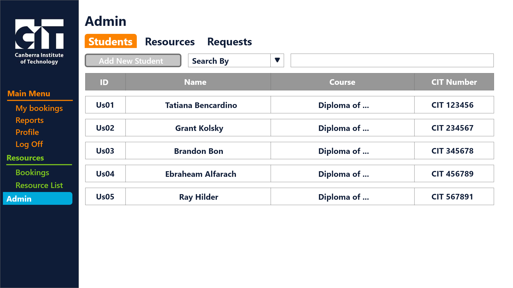
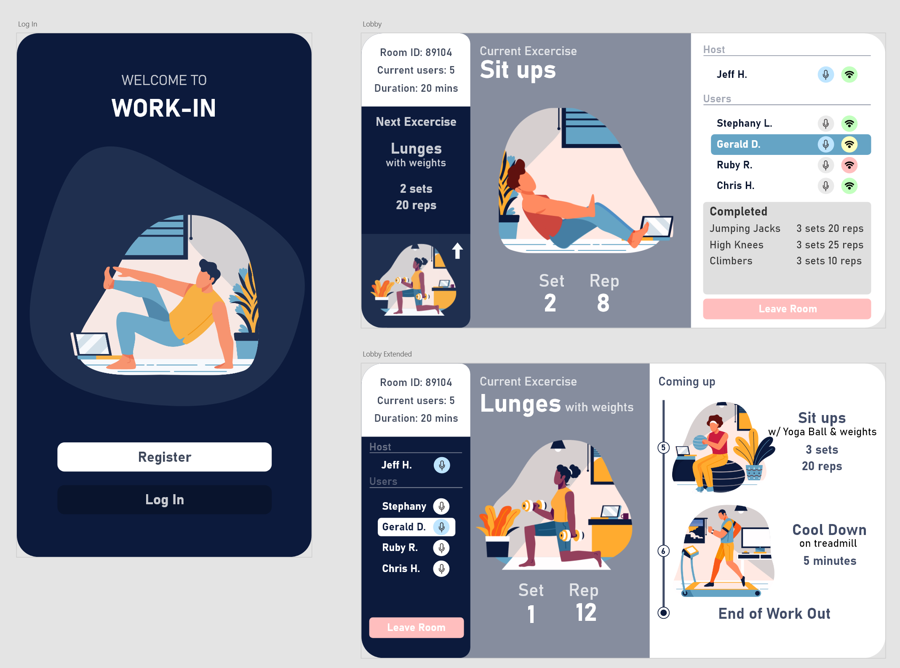
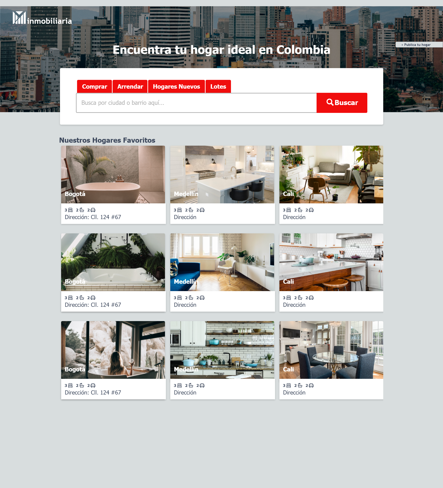
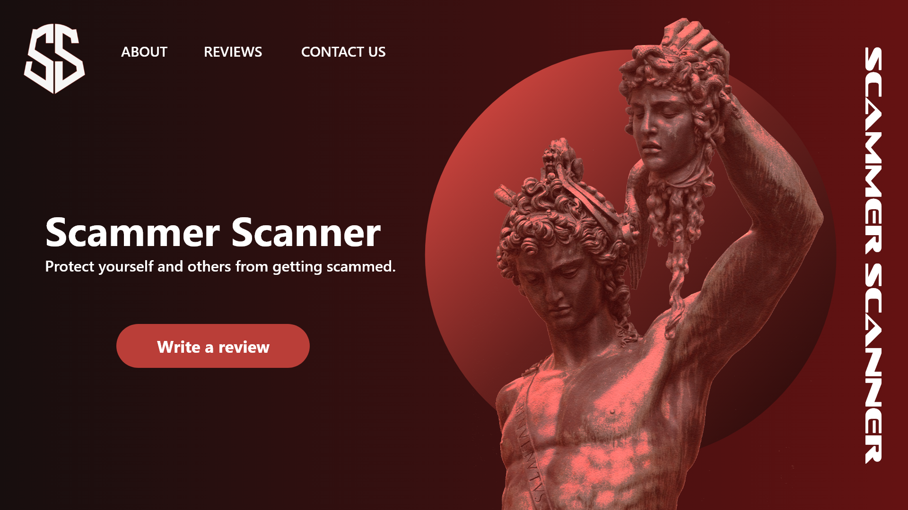
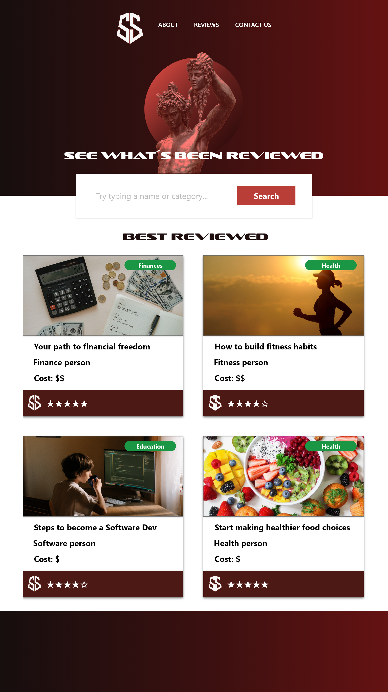
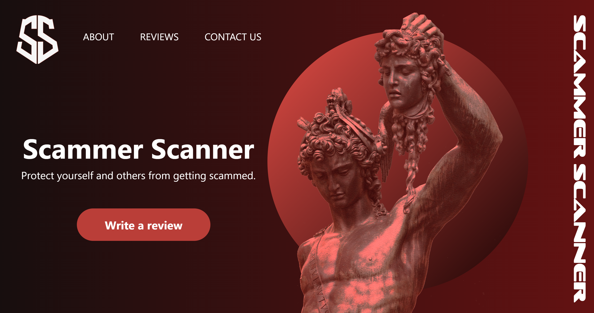

# ux-design-portfolio

This is a repository with the UX designs that I have made during my spare time or for university projects.
All the designs were done using the Adobe Creative Cloud, mainly Adobe XD for the layout and composition, Adobe Illustrator for logo design and Adobe Photoshop for image editing.

This repo is divided in multiple folders, each allocated to a specific project. This is a list of the projects and a brief description:

## OREBS

OREBS (Online Room and Equipment Booking Systems) was a project developed during my semester of the Diploma of Software Development. We were asked to start this project for the Faculty of Music and Media, we worked with the head directors of the faculty to understand the requirements of the system. One of the requirements for this web system was that it needed to have a similar look to the CIT webpage.

This is a snippet of the log-in page and the main page once a user logs in:

> More snippets can be found in the `image` folder

## Work-IN

Work-IN was an idea developed during my studies at UC, that was on the second semester of 2020. The idea of this project was to develop an app that would work similar to
Twitch, where host of a videochat room would create an in-door workout routine where other people could join and follow the routine.
This was to encourage people to work out indoors, as a solution to not being able to access gyms during the beginning of the pandemic.

I developed just a limited part of the user interface. The project was not meant to be thoroughly develop, we were just asked to think and create a business plan for an innovative idea.

## Minmobiliaria

Minmobiliaria was one of my first designs, it was inspired by AllHomes. When I decided to create this design, there were
no real state websites that had a very user-friendly interface.

> I designed the logo for this page using Adobe Illustrator
> 
## CS Force

CS Force was a project I wanted to develop when I first learnt how to write HTML and style with CSS. The following
snippet is from the design I had in mind before development:

#### Design idea

#### Look of the Website

>The logo on the right is programmed to do a small animation when the cursor hovers over it. 
> 
## Scammer Scanner

Scammer Scanner is a passion project. So far I have only developed the landing page using HTML and CSS.

#### Landing Page and Review Page Designs

#### Final look of Landing Page

> I designed the logo for this page using Adobe Illustrator

## Rental Rants

This is my latest passion project, so I am still developing the website. I am thinking of using React to do it as I want
to learn how to do it using a framework.

